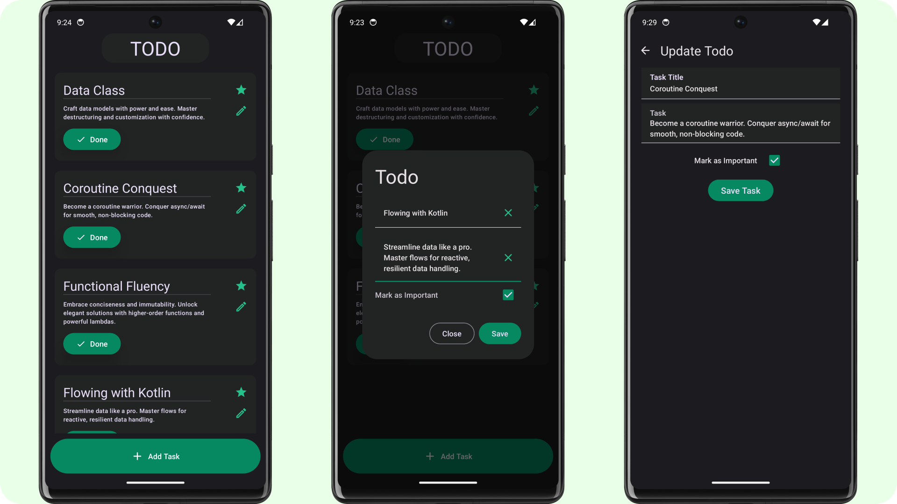

## Todo
Todo simplifies task management and helps you stay organized effortlessly.
It is built using Jetpack Compose and it follows the Model-View-ViewModel (MVVM) architecture pattern, 
ensuring separation of concerns and maintainability of code. It utilizes Room database to store data locally, 
ensuring fast and reliable access to your tasks even when offline.

## Screenshots

